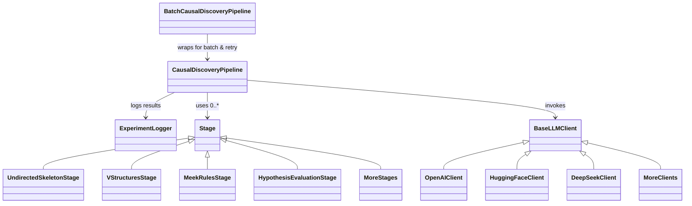

# Causal Reasoning in Pieces

</img> </img>

A modular in-context pipeline for causal discovery using Large Language Models. This project implements a multi-stage approach to causal reasoning that breaks down complex causal discovery tasks into smaller, specialized reasoning steps. The main pipeline implementation is located in the `/causal_discovery` directory, while baseline experiment implementations can be found in the `/causal_discovery_baseline` directory.

## Introduction

Causal discovery is a fundamental challenge in machine learning and statistics that aims to identify cause-effect relationships from observational data. This repository provides a flexible framework that decomposes the causal discovery process into discrete stages, each handled by a specialized LLM prompt. The modular design allows state-of-the-art reasoning models to amplify their reasoning traces, resulting in more accurate and interpretable causal discovery outcomes.

Our pipeline implements the Peter-Clark (PC) algorithm through a series of specialized language model prompts:

1. **Undirected Skeleton Discovery:** Identifying the initial graph structure
2. **V-Structure Identification:** Determining v-structures patterns
3. **Meek Rules Application:** Orienting additional edges
4. **Hypothesis Evaluation:** Testing causal hypotheses against the discovered graph

## Architecture

The architecture of the pipeline is designed to be modular and extensible. Each stage of the causal discovery process is encapsulated in a separate module, allowing for easy updates and improvements. The modules communicate through well-defined interfaces, ensuring that changes in one module do not affect the others. The pipeline interface is designed in a way that can work with any number of modules, whether the problem decomposition requires 2, 3, or more stages. It supports different LLM backends and processing modes such as sequential or batched.



## Installation

1. Clone the repository:
    ```bash
    git clone https://github.com/kacperkadziolka/causal-reasoning-in-pieces.gitcd causal-reasoning-in-pieces
    cd causal-reasoning-in-pieces
    ```
   
2. Install dependencies:
    ```bash
    python -m venv venv
    source venv/bin/activate  # On Windows: venv\Scripts\activate
    pip install -r requirements.txt
    ```

3. Set up API keys:
    ```bash
    echo "OPENAI_API_KEY=your_openai_key" > .env
    echo "DEEPSEEK_API_KEY=your_deepseek_key" >> .env
    echo "HF_TOKEN=your_huggingface_token" >> .env
    ```
   
If you want to use huggingface backend, make sure to have pytorch installed. We recommend using python `3.12+`.

## Usage Examples

Run experiments with different backend options and configurations, such as batch size, mode, input file and number of samples to run.

**OpenAI Backend:**
```bash
python causal_discovery/main.py \
  --backend openai \
  --mode sequential \
  --input_file data/test_dataset.csv \
  --num_experiments 10
```

**DeepSeek Backend:**
```bash
python causal_discovery/main.py \
  --backend deepseek \
  --mode batched \
  --batch_size 8 \
  --input_file data/test_dataset.csv \
  --num_experiments 20
```

## Project Structure

- `causal_discovery/` - Main package
  - `llm_client.py `- LLM client implementations
  - `main.py` - Entry point for the application
  - `pipeline/` - Pipeline implementation
    - `pipeline.py` - Core pipeline logic
    - `stages.py `- Individual pipeline stages
  - `prompts.yaml` - LLM prompts for each stage
  - `utils.py` - Utility functions for parsing responses
  - `experiment_logger.py` - Logging utilities
